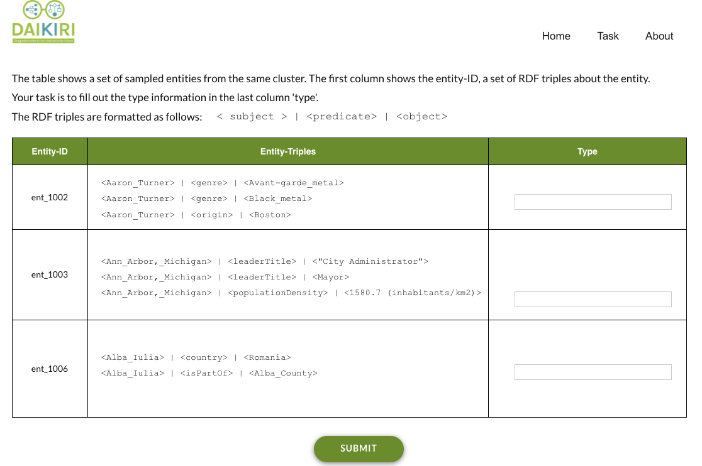

# LabENT
This project employs a web application (dubb LabENT) for labelling entities in knowledge graphs that enable users to annotate selected entities based on clustering, then propagate the major type to all other entities within the same cluster. 


<p align="center">

</p>
<p align="center">A Screenshoot of LabENT v.1</p>

---
## Docker:
> ### Build from docker-compose (recommended)
Probably the easiest way to get started is by using the provided Docker image. From the project's root directory, the image can be built like so:
* `cd labENT-docker`

Now the docker compose to build the LabENT project. This might takes few minutes to install and configure components: wordpress, PHP, and MySQL.
* `docker-compose up -d --build` 

If you are using Docker Desktop for Mac, Linux or Windows, you can use in a web browser
* `http://localhost:8000` 
---
## DAIKIRI Panel: How it works:

* <b>Load Data</b>:  `Lymphography` contains a case study from Lymphography dataset, in particular:
    * `preprocessing/lymphograph-triples.rdf`: contains RDF triples (nt format) in the following format: 
  ```
  <4hutyt> <http://www.daikiri.cc/lymphography#defectInNode> "lacunar" .
  <n4mka4> <http://www.daikiri.cc/lymphography#regenerationOF> "no" .
  <431kz1> <http://www.daikiri.cc/lymphography#exclusionOfNo> "yes" .
  <jdcxvz> <http://www.daikiri.cc/lymphography#dislocationOf> "no" .
  <a3kveh> <http://www.daikiri.cc/lymphography#earlyUptakeIn> "yes" .
  <8eii6v> <http://www.daikiri.cc/lymphography#earlyUptakeIn> "yes" .
  <i7jm5o> <http://www.daikiri.cc/lymphography#blockOfAffere> "yes" .
  <xql5ex> <http://www.daikiri.cc/lymphography#blockOfLymphC> "no" .
  <ia6ew2> <http://www.daikiri.cc/lymphography#BlockOfLymphS> "no" .
  <qlggwo> <http://www.daikiri.cc/lymphography#changesInstru> "stripped" .
  <5fywjn> <http://www.daikiri.cc/lymphography#ByPass> "no" .
  ``` 
    * `Input/clusteringOutput.csv`: contains the clustering results for the Lymphography dataset in the following format: 
    ```
    patient cluster
    r0srju cluster-1
    431kz1 cluster-2
    xi0aej cluster-1
    u65736 cluster-1
    sozm8t cluster-2
    09ey1n cluster-2
    6n456m cluster-2
    4hutyt cluster-2
    kvxujq cluster-1
    zv68br cluster-1
    mtigwr cluster-2
    ```
<b> To process this data and load into LabENT demo, simply run:</b> `sh script-lymphograph.sh`

* <b>Annotate Button</b>: once the user click on, it presents the data (clusterID, set of triples) for labelling. The user should add the label in the last column in the presented table. Then, click on <i>Submit</i> button to save the data.

* <b>Export Button</b>: LabENT also allows to export the annotated data and download into your local machine.

* <b> Axiom Generator Button </b>: Once you click on, it calls the <i>Axiom-Generator</i> module that allows to upload two csv files: 1) labeled_data.csv, 2) clusteringOutput.csv; then generate the corresponding OWL ontology that can be download if you click on <b>Download Ontology</b> button. 

* <b>Upload Button</b>: You can edit the generated ontology e.g. using Protege and upload it back. The upload file will be located into 
`LabENT-docker/wp-content/uploads`
---
## Aknowledgment: 
This project is configured to work as a part of DAIKIRI project pipeline for ontology learning and structured machine learning from industrial data. If you have any further questions or feedback, please feel free to contact `hamada.zahera@upb.de`


