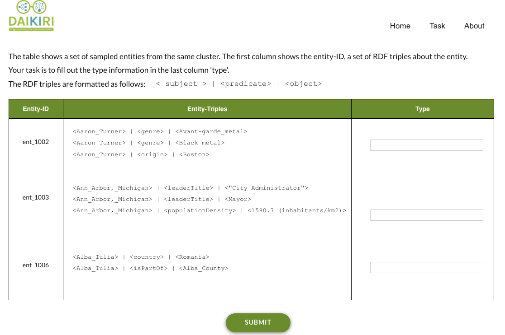

# LabENT
This project employs a web application (dubb LabENT) for labelling entities in knowledge graphs that enable users to annotate selected entities based on clustering, then propagate the major type to all other entities within the same cluster. 

A Screenshoot of LabENT v.1

---
## Docker:
Probably the easiest way to get started is by using the provided Docker image. From the project's root directory, the image can be built like so:
* `cd wordpress`

Now the docker compose to build the LabENT project. This might takes few minutes to install and configure components: wordpress, PHP, and MySQL.
* `docker-compose up -d` 

If you are using Docker Desktop for Mac, Linux or Windows, you can use in a web browser
* `http://localhost:8000` 

To login into Wordpress CMS, please go to 
* `http://localhost:8000/wp-logn.php`

---
## Aknowledgment: 
This project is configured to work as a part of DAIKIRI project pipeline for ontology learning and structured machine learning from industrial data. If you have any further questions or feedback, please feel free to contact `hamada.zahera@upb.de`

